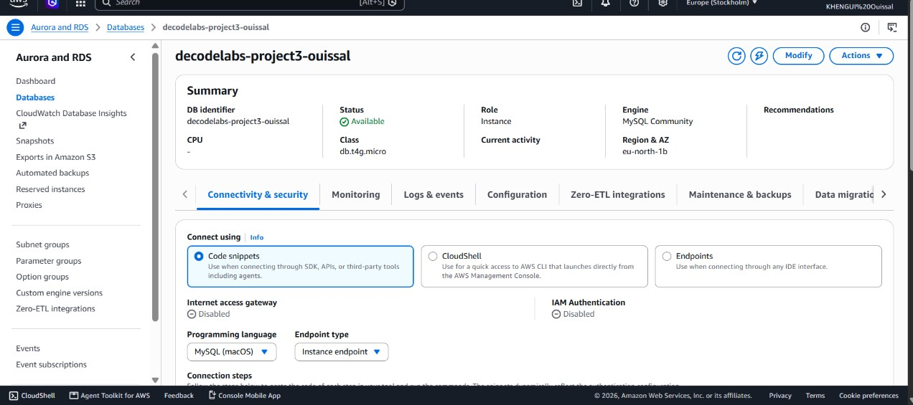
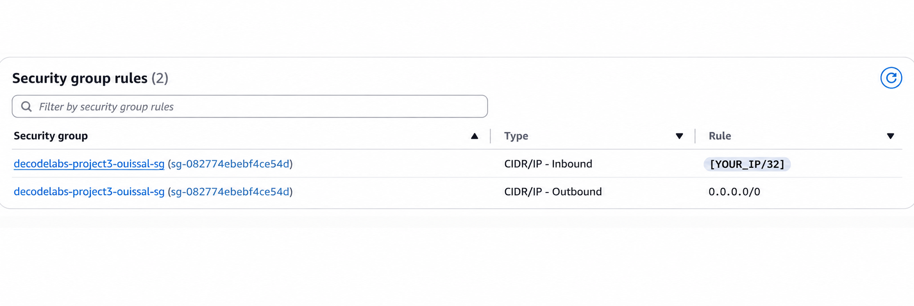
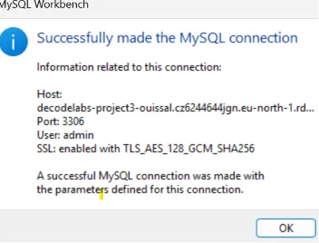
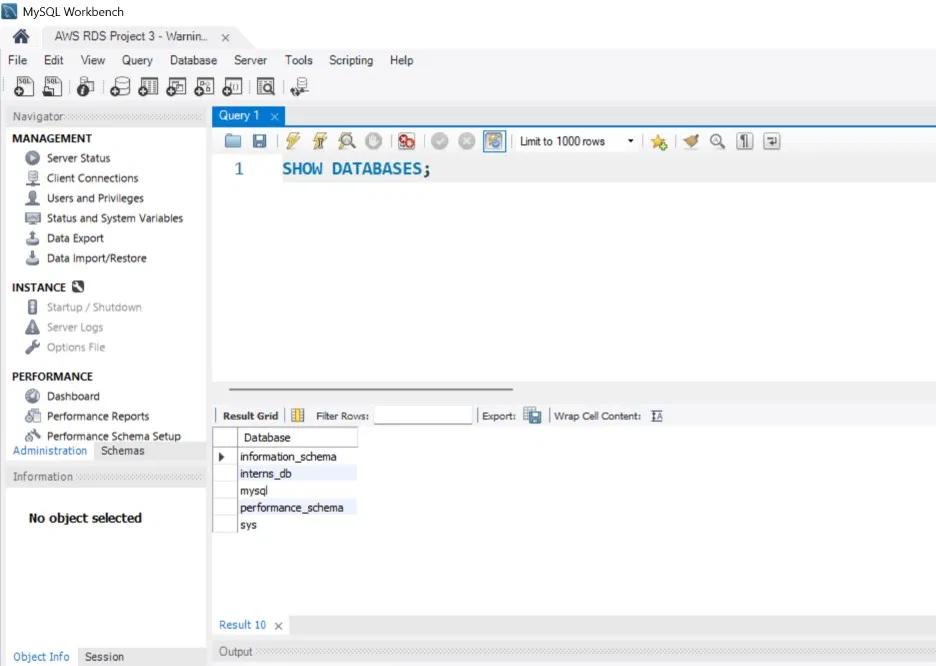
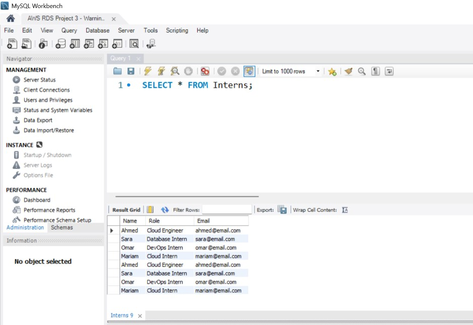
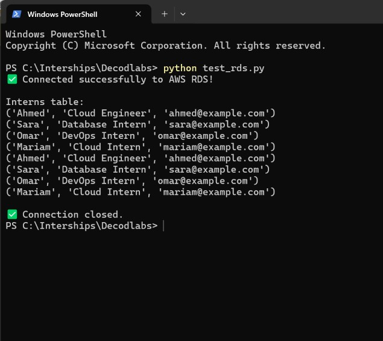

# AWS RDS MySQL – Cloud Database Deployment

## 📋 Project Overview

This project demonstrates the deployment and configuration of a managed relational database on **Amazon Web Services (AWS)** using **Amazon RDS with MySQL**.

The objective is to deploy a reliable, scalable, and secure cloud-hosted database, store intern records, and verify data persistence through SQL, MySQL Workbench, and Python.

During the implementation, the project:

- Provisioned a MySQL database using Amazon RDS
- Configured database connectivity and network security
- Created the `interns_db` database
- Created an `Interns` table
- Defined the `Name`, `Role`, and `Email` columns
- Inserted test records
- Verified data persistence using SQL queries
- Connected to the database using MySQL Workbench
- Connected to the database programmatically using Python

The result is a functional **cloud-hosted MySQL database** accessible through both a local SQL client and Python.

---

## 🏗️ Architecture

```text
┌──────────────────────┐
│    Local Computer    │
│                       │
│  MySQL Workbench      │
│        +              │
│      Python           │
└──────────┬────────────┘
           │
           │ MySQL / TLS
           │ Port 3306
           ▼
┌──────────────────────┐
│     Amazon Web        │
│       Services        │
│        (AWS)          │
└──────────┬────────────┘
           │
           ▼
┌──────────────────────┐
│      Amazon RDS       │
│                       │
│   MySQL Community     │
└──────────┬────────────┘
           │
           ▼
┌──────────────────────┐
│      interns_db       │
│                       │
│    Interns Table      │
├──────────────────────┤
│ Name                  │
│ Role                  │
│ Email                 │
└──────────────────────┘
```

---

## 🛠️ Technologies

- Amazon Web Services (AWS)
- Amazon RDS
- MySQL Community
- MySQL Workbench
- Python
- mysql-connector-python
- Git
- GitHub
- PowerShell

---

## ⚙️ Cloud Database Configuration

The RDS instance was configured with the following parameters:

| Configuration | Value |
|---|---|
| Cloud Provider | AWS |
| Database Service | Amazon RDS |
| Database Engine | MySQL Community |
| Instance Class | db.t4g.micro |
| Region | eu-north-1 |
| Availability Zone | eu-north-1b |
| Port | 3306 |
| Database | interns_db |
| Table | Interns |

The RDS instance successfully reached the **Available** status.

---

## 🔒 Security

The RDS instance uses an **AWS Security Group** to control network access.

The database was configured to allow inbound MySQL connections only from the authorized client IP address using a `/32` CIDR rule.

**Inbound:**
```
Authorized Client IP /32
```

**Outbound:**
```
0.0.0.0/0
```

The database connection was also successfully tested using **SSL/TLS** through MySQL Workbench.

> This configuration demonstrates basic cloud network security by restricting database access to an authorized source.
> The public client IP address is intentionally not exposed in this README.

---

## 🗄️ Database Structure

The project uses the following database:

```
interns_db
```

The main table is:

```
Interns
```

### Table Structure

| Column | Description |
|---|---|
| Name | Intern name |
| Role | Intern role |
| Email | Intern email |

---

## 🧱 Database Creation

The database was created using MySQL:

```sql
CREATE DATABASE interns_db;

USE interns_db;
```

The `Interns` table was then created:

```sql
CREATE TABLE Interns (
    Name VARCHAR(100),
    Role VARCHAR(100),
    Email VARCHAR(150)
);
```

Test records were inserted into the table:

```sql
INSERT INTO Interns (Name, Role, Email)
VALUES
('Ahmed', 'Cloud Engineer', 'ahmed@example.com'),
('Sara', 'Database Intern', 'sara@example.com'),
('Omar', 'DevOps Intern', 'omar@example.com'),
('Mariam', 'Cloud Intern', 'mariam@example.com');
```

---

## 🧪 Database Testing

The database and table were tested using SQL queries.

**Verify Databases**
```sql
SHOW DATABASES;
```
The `interns_db` database was successfully displayed.

**Select Database**
```sql
USE interns_db;
```

**Retrieve Intern Records**
```sql
SELECT * FROM Interns;
```
The query successfully returned the inserted test records.

> This confirms that data can be stored and retrieved from the cloud-hosted database.

---

## 🖥️ MySQL Workbench

The AWS RDS MySQL database was successfully connected using MySQL Workbench.

The connection was configured using:

- RDS endpoint
- MySQL port: `3306`
- User: `admin`
- SSL/TLS: Enabled

> The successful connection confirms that the cloud database is accessible from a local SQL client.

---

## 🐍 Python Integration

A Python script named `test_rds.py` was created to connect programmatically to the AWS RDS MySQL database.

The script uses:

```
mysql-connector-python
```

The Python script:

1. Connects to the RDS MySQL endpoint
2. Authenticates using the configured database user
3. Selects the `interns_db` database
4. Executes a SQL query
5. Retrieves records from the `Interns` table
6. Displays the retrieved records
7. Closes the database connection

> The Python connection was successfully tested.

---

## 📁 Project Structure

```
task-3-decodelabs/
│
├── test_rds.py
├── requirements.txt
├── README.md
├── .gitignore
│
└── images/
    ├── 01-aws-rds-database-available.jpg
    ├── 02-security-group.jpg
    ├── 03-mysql-workbench-connection.jpg
    ├── 04-show-databases.jpg
    ├── 05-select-interns-records.jpg
    └── 06-python-rds-connection.jpg
```

---

## 📸 Deployment & Testing Screenshots

### 1. AWS RDS — Database Available

The Amazon RDS MySQL instance was successfully created and reached the Available status.



---

### 2. Security Group

The AWS Security Group was configured to allow the required database connectivity.



---

### 3. MySQL Workbench — Successful Connection

The AWS RDS MySQL database was successfully accessed using MySQL Workbench.



---

### 4. SHOW DATABASES — interns_db

The database was verified using the SHOW DATABASES SQL command.



---

### 5. SELECT * FROM Interns — Records

The Interns table was queried successfully and the inserted test records were displayed.



---

### 6. Python — Connected Successfully to AWS RDS

The Python script successfully connected to the AWS RDS MySQL database and retrieved records from the Interns table.



---

## 📦 Python Requirements

Install the required dependency using:

```bash
pip install -r requirements.txt
```

The project requires:

```
mysql-connector-python
```

---

## ▶️ Running the Python Test

Run the Python database connection script:

```bash
python test_rds.py
```

A successful execution confirms the connection to AWS RDS and displays the records stored in the Interns table.

**Example successful output:**

```
Connected successfully to AWS RDS!

Interns table:
('Ahmed', 'Cloud Engineer', 'ahmed@example.com')
('Sara', 'Database Intern', 'sara@example.com')
('Omar', 'DevOps Intern', 'omar@example.com')
('Mariam', 'Cloud Intern', 'mariam@example.com')

Connection closed.
```

---

## ✅ Data Persistence Verification

Data persistence was verified through the following process:

1. Created the `interns_db` database.
2. Created the `Interns` table.
3. Inserted test records.
4. Retrieved the records using MySQL Workbench.
5. Retrieved the same records using Python.
6. Confirmed successful connection and data retrieval from AWS RDS.

> This confirms that the data was successfully stored and retrieved from the managed cloud database.

---

## 🧠 Skills Demonstrated

- Amazon Web Services (AWS)
- Amazon RDS
- Cloud Database Deployment
- MySQL Database Administration
- SQL
- MySQL Workbench
- Python Database Connectivity
- Security Group Configuration
- SSL/TLS Database Connectivity
- Git & GitHub
- PowerShell
- Cloud Infrastructure Management
- Data Persistence Testing

---

## 🚦 Project Status

**Status: Completed ✅**

This project successfully demonstrates the deployment, configuration, connectivity, and testing of a managed MySQL cloud database using Amazon RDS.

The database was successfully accessed through both MySQL Workbench and Python, and data persistence was verified.

---

## 👤 Author

**Ouissal Khengui**

GitHub: [https://github.com/ouissal-kh](https://github.com/ouissal-kh)

---

## 📄 License

This project was developed as part of the **DecodeLabs Cloud & DevOps Training Program** for educational and portfolio purposes.